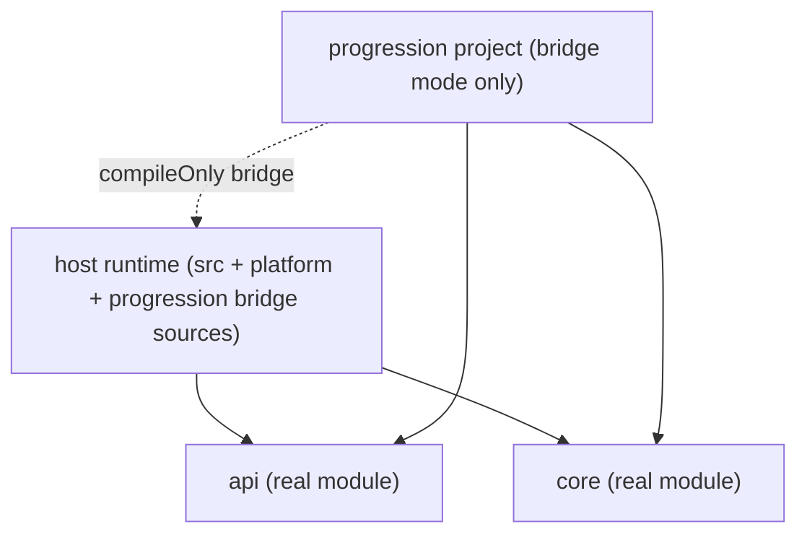
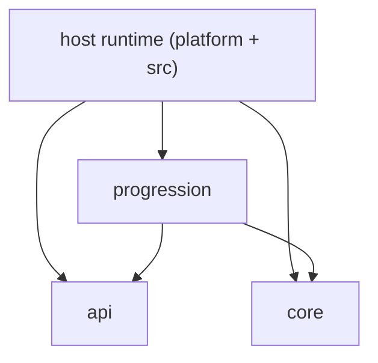

# Ecosystem Module Dependency Graph

## Actual Graph Today

Notes:

- Host runtime consumes `:api` and `:core` as real project dependencies.
- Host runtime still compiles `progression/src/main/java` directly.
- `:progression` exists as an included project, but its dependency on host
  output/classpath means it is not a clean module boundary yet.

## Repo Decision Snapshot

- Create now: `api`, `core`
- Subproject now, repo later: `progression`
- Stay host-owned now: `platform`, `src`
- Not real modules yet: tech, magic, machine, world, similar domain splits

## Target Graph After Progression Cleanup

## Forbidden Directions

1. `core` -> host gameplay/runtime packages
2. `api` -> host gameplay/runtime packages
3. future compat/domain modules -> each other by default
4. circular dependencies between any extracted modules

## Current Temporary Exception

- `progression` -> host runtime compile classpath is temporarily allowed only in
  bridge mode and only until host-runtime imports are removed.
