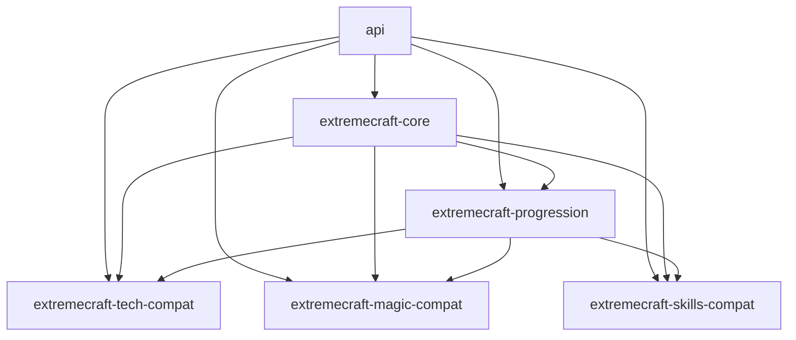

# Ecosystem Module Dependency Graph

## Current Intended Graph

## Root Runtime Module

- Root runtime module currently depends on:
  - `:api`
  - `:extremecraft-core`
  - `:extremecraft-progression`
- Root still contains launch glue, migration adapters, and not-yet-extracted implementation ownership.

## Forbidden Dependency Directions

1. `extremecraft-core` -> any compat module (`tech/magic/skills`): forbidden.
2. `extremecraft-core` -> `extremecraft-progression`: forbidden.
3. Compat module -> compat module: forbidden by default.
4. Any module -> root runtime module: forbidden.
5. Circular dependencies between any ecosystem modules: forbidden.

## Allowed Optional Runtime Relationships

- `extremecraft-tech-compat` may require Mekanism/Extreme Reactors at runtime.
- `extremecraft-magic-compat` may require Ars Nouveau at runtime.
- `extremecraft-skills-compat` may require Pufferfish Skills at runtime.
- Progression remains authoritative when compat modules are present.

## Publication-Oriented Relationship Model

- `extremecraft-core`: base required dependency.
- `extremecraft-progression`: gameplay authority layer depending on core.
- compat modules: optional addons depending on core + progression contracts.
