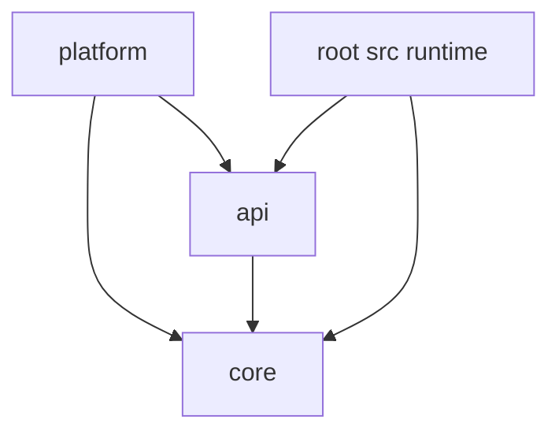

# Ecosystem Module Dependency Graph

## Current Intended Graph

## Root Runtime Module

- Root runtime module currently depends on:
  - `:api`
  - `:core`
- Root still contains launch glue, migration adapters, and not-yet-extracted gameplay ownership.

## Forbidden Dependency Directions

1. `core` -> any compat module (`tech/magic/skills`): forbidden.
2. `core` -> a progression authority module: forbidden.
3. Compat module -> compat module: forbidden by default.
4. Any module -> root runtime module: forbidden.
5. Circular dependencies between any ecosystem modules: forbidden.

## Allowed Optional Runtime Relationships

- Progression remains authoritative while the monolith runtime owns the active gameplay systems.
- `platform/` is the adapter/home for bootstrap and compatibility glue.

## Publication-Oriented Relationship Model

- `core`: base required dependency.
- `platform`: runtime bootstrap and glue over core + root gameplay.
- future compat modules: optional addons depending on core + runtime contracts.
